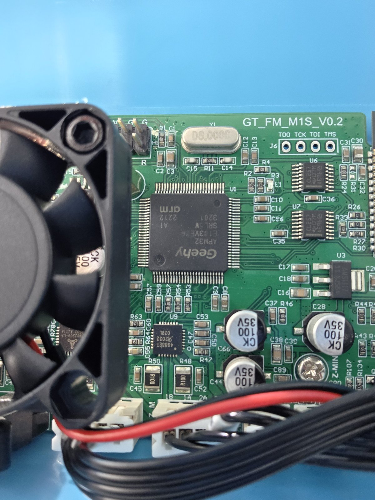
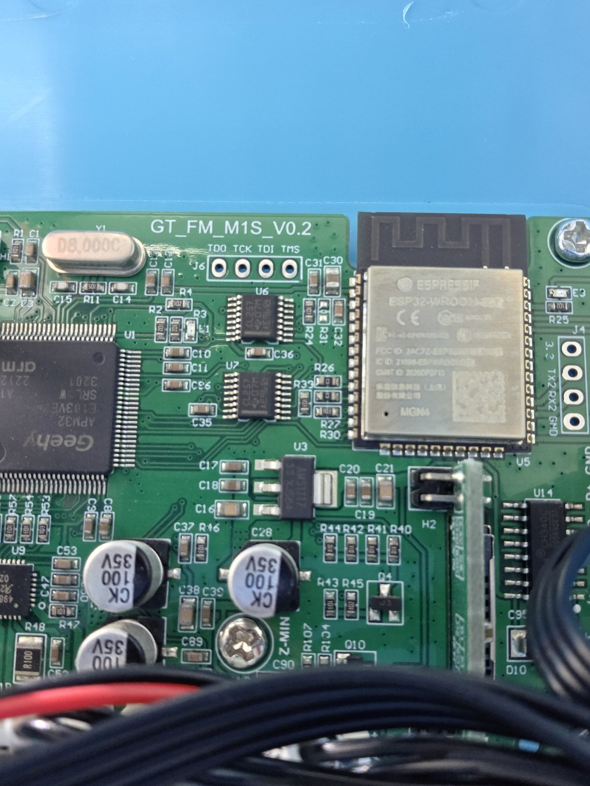
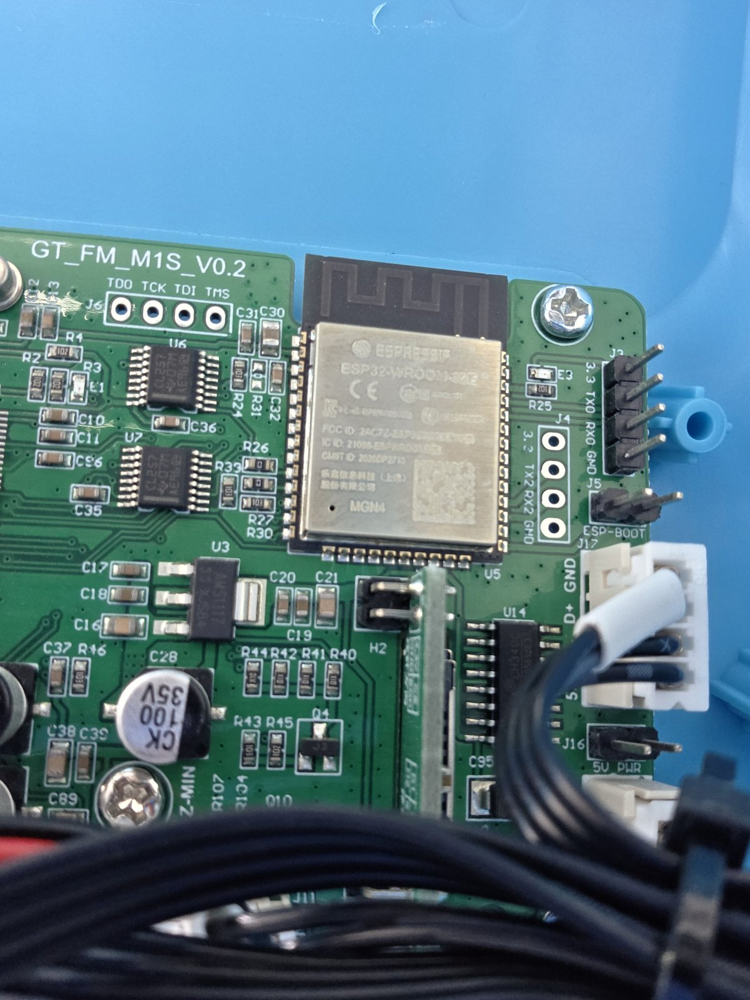
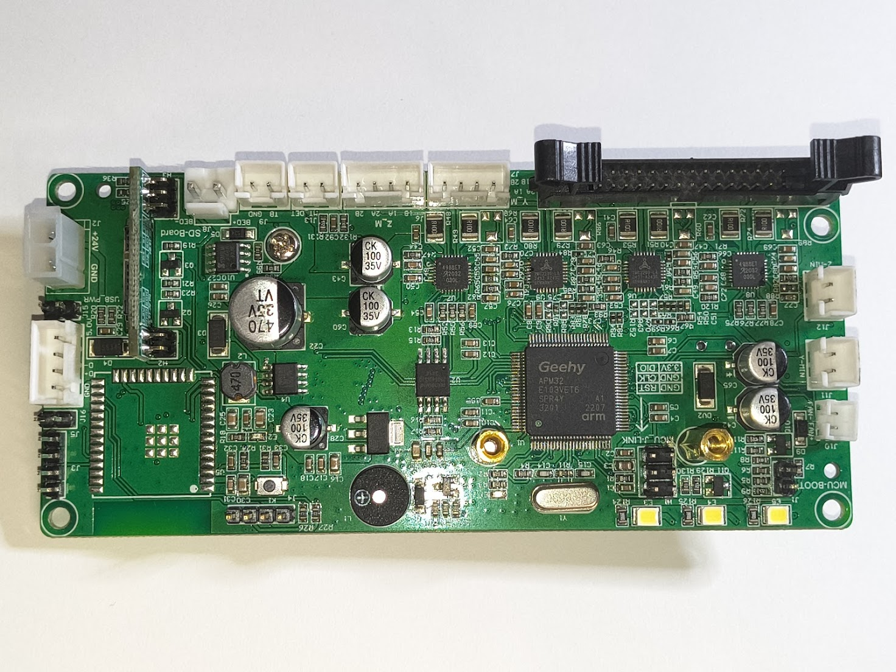
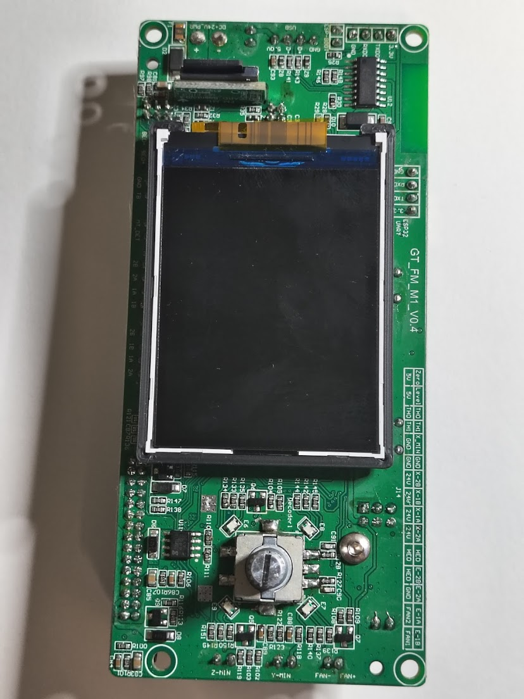
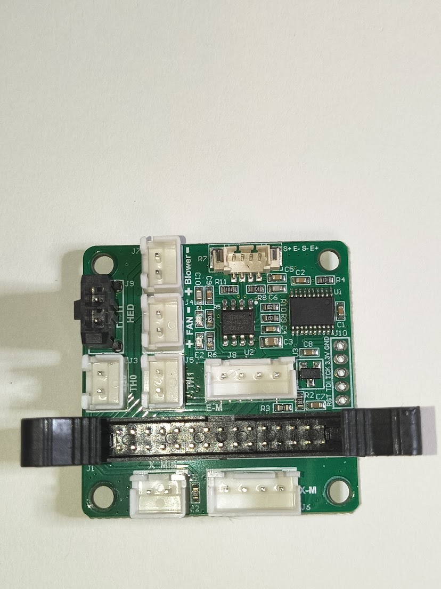
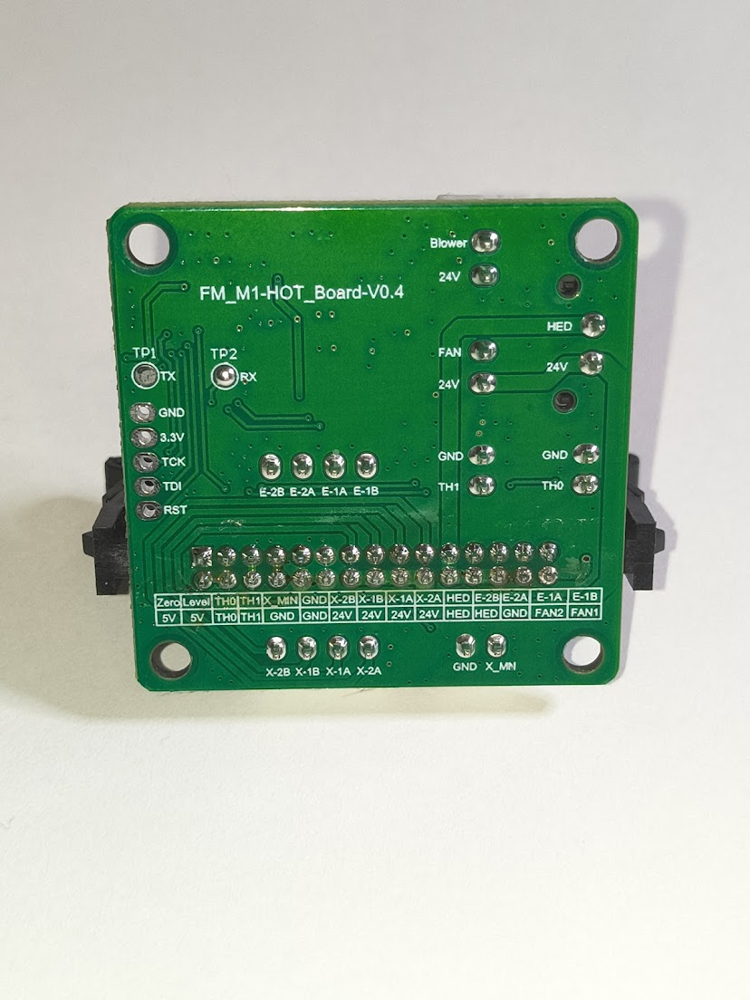
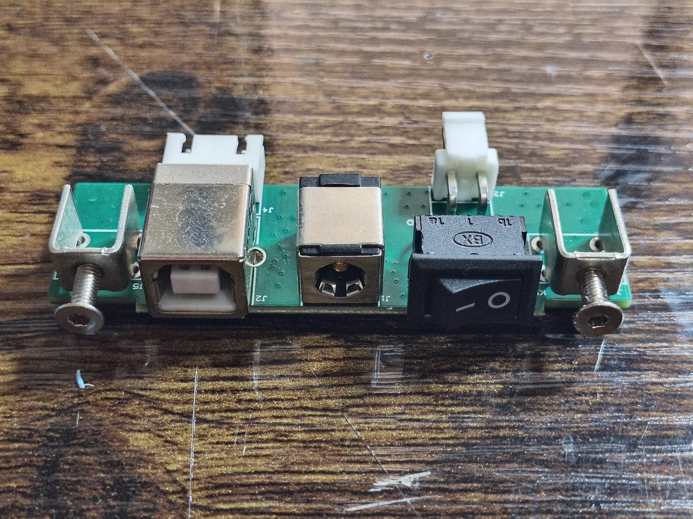

# Electronics teardown

**The M1S does not use the M1 mainboard.** Photos of this unit (2026-08-22) show a single board marked `GT_FM_M1S_V0.2` mounted in the top of the frame, with the ESP32 soldered on. The M1 section further down (two-board `GT_FM_M1_V0.4` sandwich, in the base) is kept for reference because the MCU, driver mix, and printhead board appear to be shared, but connector positions and headers differ. Photos: [`photos/m1s/`](../photos/m1s/).

## M1S mainboard (`GT_FM_M1S_V0.2`)

| Ref | Part | Notes |
|---|---|---|
| U1 | **Geehy APM32E103VET6** (`SRL5W 3201 A1 2212`) | Same MCU as the M1. |
| Y1 | Crystal marked `D8.000C` | **8 MHz**. Confirms the Klipper clock setting. |
| U9 | `4988ET A2032 029L` | A4988-class, next to the `Z-M` connector. |
| (under fan) | `TMC2209-LA 2502 A271A` | Genuine Trinamic, near `Y-M`. |
| U11 area | second TMC2209 visible at an angle near `Y-M` / `X-M` | |
| U14 | **CH340C** (`CH340C 2056S5E37`) | USB-UART. The C variant has an internal oscillator. |
| U5 | **ESP32-WROOM-32E** (Espressif, MGN4 lot) | Soldered to the mainboard, PCB antenna over the board edge. |
| U6, U7 | TI `CL257 D7M` (TSSOP-16) x2 | TI marking for **SN74CBTLV3257** / `74*257`-family quad 2:1 mux. Two of them = 8 switched lines. Sitting between the MCU, the JTAG header and the ESP32, the obvious use is routing the MCU's UART (and possibly JTAG/boot lines) between the CH340 and the ESP32 under control of a GPIO or the `H2` jumper. Unverified. |
| U3 | AMS1117-3.3 | 3.3 V LDO |
| U2 | **Winbond W25Q64JV** 8 MB SPI flash, next to `H1` | External storage - likely Marlin's EEPROM backend (the `V88` 773-byte settings) and/or power-loss resume state. Not dumpable over SWD directly; not needed for the Klipper conversion. |
| U8, U11 | TMC2209-LA (`2502 A271A`) | X and Y drivers |
| U9, U10 | `4988ET 2032 029L` | Z and E drivers |
| U? | Buzzer, 3 white LEDs, a 40 mm fan over the MCU/driver area | The LEDs on the board edge are the case light. |

Headers and jumpers seen so far:

| Label | Pins | Purpose |
|---|---|---|
| `J6` | `TDO TCK TDI TMS` (unpopulated holes) | JTAG. Superseded by `H1` below for SWD use. |
| `H1` | populated 2x3 right-angle header by the crystal | **SWD header** (confirmed 2026-08-25): top row `V G G`, bottom row `D C R` = `3.3V/DIO GND/CLK GND/RST`. |
| `J1 MCU-BOOT` | populated 2-pin jumper below `H1` | **BOOT0** (by silkscreen name; M1 had the same). Bridge + power-cycle should enter the ROM UART bootloader. |
| `J3` | `3.3 TX0 RX0 GND` (right-angle pins, next to `ESP-BOOT`) | ESP32 UART0 (its console / flashing port). |
| `J4` | `3.3 TX2 RX2 GND` (unpopulated) | ESP32 UART2, most likely the link to the MCU. |
| `J5` | `ESP-BOOT` 2-pin | ESP32 GPIO0 strap for flashing. |
| `H2` | 2 pins | NOT a jumper: board-to-board pins into the perpendicular daughterboard next to it. BOOT0-jumper theory retired; no accessible BOOT0 found so far. |
| `J16` | `5V PWR` | 5 V / USB power jumper, same role as `USB_PWR` on the M1. |
| `J17` | `D+ GND` pads | USB data pads. |
| `Z-MIN`, `Y-M`, `X-M`, `Z-M` | JSTs | Z endstop and motors. |
| `J8` | 4-pin JST labelled `Y-M` | Y motor |

Bottom edge (2026-08-25 photos): `TB`/`GND` bed thermistor, `BED+ BED-` heater output, `+24V GND` power input, `J17` `5.0V D- D+ GND` = USB from the rear-panel B jack, grey 16-way ribbon to the printhead, `Z-M` and `J8 Y_M` motor JSTs on the right edge, buzzer + 3 LEDs + SS34/buck power section. Still unphotographed: the TF slot and display connector details (both on the perpendicular daughterboard `H2` plugs into).

Practical consequences:

- The 8 MHz crystal and CH340C match the Klipper build settings already in `docs/firmware.md`.
- SWD is on `J6` (TCK/TMS). Power the board from 24 V or the `J16` jumper with USB, connect the ST-Link's SWDIO to `TMS`, SWCLK to `TCK`, GND to `J3` GND, and leave the 3.3 V pin unconnected (the board powers itself).
- If the `CL257` muxes sit between the MCU UART and the CH340, the ROM bootloader route over USB depends on the mux being set to the CH340 side at reset. SWD avoids that question entirely.
- The ESP32 talks to the MCU over a UART (probably UART2 on `J4`). Under Klipper it can be left alone; it only does anything if the stock Marlin is talking to it.

## M1 boards (reference)

Photos: [`photos/stock-m1/`](../photos/stock-m1/), zoomed chips in [`photos/crops/`](../photos/crops/).

Material below is from the 0dysseusRex M1 photos.

### Overview

Three PCBs plus a rear I/O breakout:

1. **Mainboard** (`GT_FM_M1_V0.4` silkscreen on the display side) - MCU, drivers, power, bed heater MOSFET. Two boards sandwiched: a power/driver board and a display/interface board.
2. **Printhead board** (`FM_M1-HOT_Board-V0.4`) - on the toolhead. Own MCU, load-cell ADC, connectors for hotend, fans, X motor, X endstop, extruder motor. Joined to the mainboard by a 16-way ribbon.
3. **Rear I/O board** - USB-B, DC barrel jack, rocker switch, one JST. Passive.
4. **Z endstop board** - microswitch on a tiny PCB in the base.

### M1 mainboard, driver side

| Ref | Part | Notes |
|---|---|---|
| U1 | **Geehy APM32E103VET6** (marking `APM32 E103VET6 SPR4Y 3201 A1 2207`) | STM32F103VE clone. Cortex-M3, 72 MHz, 512 KB flash, 128 KB SRAM, LQFP100. |
| U7, U8 | **`4988ET`** (marking `4988ET A2032 030L`) | A4988-compatible step/dir driver, no UART. Z and E (confirmed by `M122`/`M906` only listing X and Y). |
| U9, U6 | **TMC2209-LA** (Trinamic, `2433 A243S GERMANY`) | Genuine Trinamic. X (UART addr 0) and Y (addr 3). UART is routed; Y responds, X does not (see probe log). |
| Y1 | crystal | 8 MHz assumed (standard for F103); check with `M115`/Klipper clock. |
| - | `470 35V` electrolytic + inductor | 24 V to 5 V buck. |
| - | `CK 100 35V` x4 | Driver bulk caps. |
| - | Buzzer | Active buzzer near the MCU. |

Headers and connectors on this side:

| Label | Purpose |
|---|---|
| `+24V GND` (J2, 2-pin) | Main DC input from rear board |
| `USB_PWR` (J15 jumper) | Power board from USB 5 V (for flashing without 24 V) |
| `MCU-BOOT` (J7 jumper, bottom right) | BOOT0. Jumpered at power-up puts the APM32 into the ROM UART bootloader. |
| `MCU-J-LINK` (6 pins: `3.3V DIO / GND CLK / GND RST`) | SWD. Use for firmware dump and recovery. |
| `SD-Board` (J8) | micro SD slot daughterboard |
| `Z-M`, `Y-M` | Z and Y motor JSTs (right edge) |
| `Y-MIN` | Y endstop |
| `FAN- FAN+` (J10/J11) | Mainboard fan |
| `BED- BED+` | Bed heater output |
| `TB` | Bed thermistor |
| 16-pin box header (top right) | Ribbon to printhead board |
| `J3` 4-pin, `J5`/`J16` | Z endstop, filament sensor, LED (assignment TBD) |

### M1 mainboard, display side

| Ref | Part | Notes |
|---|---|---|
| - | 2.4" TFT, ~18-pin FPC | SPI TFT, controller unknown (ST7789 or ILI9341 class). Not supported by Klipper. |
| Encoder1 | Rotary encoder with push | Menu knob |
| U12 | SOP-16 next to `USB D+ D- 5.0V` pads | CH340 USB-to-UART (enumerates as `1a86:7523`). The host sees a serial port, not a native STM32 CDC device. Marlin runs it at 250000 baud. |
| `ESP32 UART` header | `3.3V TXD0 RXD0 GND` | Socket for the M1S WiFi/BT module. It is a UART peripheral, not a host. |
| `ESP-BOOT` | 2-pin | ESP32 boot strap, for reflashing the module. |
| U11 | SOIC-8 near the encoder | Unknown, possibly EEPROM or level shifter. |
| `DC+24V_PWR` | 2 pads | Power input pass-through |

Pin labels along the top edge of this board are the ribbon signals, documented under the printhead board below.

### Printhead board (`FM_M1-HOT_Board-V0.4`)

| Ref | Part | Notes |
|---|---|---|
| U1 | TSSOP-20 MCU, marking unreadable | Has a programming header `J10`: `RST TDI TCK 3.3V GND`, plus `TP1 TX` / `TP2 RX` test points. TDI/TCK labeling suggests a 2-wire debug interface on a small 8-bit or Cortex-M0 part. Identify when the unit is open. |
| U2 | **Chipsea CS1237** (SOIC-8, marking `CS1237-SO`) | 24-bit load-cell ADC, 2-wire (SCLK/DOUT) interface to U1. |
| U3 | SOT-23 | Likely 3.3 V LDO. |
| J7 `S+ E- S- E+` | 4-pin | Load cell (strain gauge) input |
| J9 `HED` | 2-pin | Hotend heater (24 V) |
| J3 `TH0`, J5 `TH1` | 2-pin each | Hotend thermistor and a second thermistor (bed-side? chamber? check) |
| J4 `FAN`, `Blower` | 2-pin each | Hotend fan and part cooling blower |
| J8 `E-M` | 4-pin | Extruder motor |
| J6 `X-M` | 4-pin | X motor |
| J2 `X-MIN` | 2-pin | X endstop |
| J1 | 16-pin box header | Ribbon to mainboard |

### Ribbon pinout (from silkscreen on both boards)

Two rows of 8. Labels as printed:

| Pin | Row A | Row B |
|---|---|---|
| 1 | `Zero` | `5V` |
| 2 | `Level` | `5V` |
| 3 | `TH0` | `TH0` |
| 4 | `TH1` | `TH1` |
| 5 | `X_MIN` | `GND` |
| 6 | `GND` | `GND` |
| 7 | `X-2B` | `24V` |
| 8 | `X-1B` | `24V` |
| 9 | `X-1A` | `24V` |
| 10 | `X-2A` | `24V` |
| 11 | `HED` | `HED` |
| 12 | `E-2B` | `HED` |
| 13 | `E-2A` | `GND` |
| 14 | `E-1A` | `FAN2` |
| 15 | `E-1B` | `FAN1` |

(15 labelled columns are printed; the 16th is probably a second ground. Confirm with a meter.)

What this tells us:

- **The printhead MCU owns the load cell.** It reads the CS1237 and presents the probe to the mainboard as one digital output, `Level`, and accepts one digital input, `Zero`, to tare. The mainboard's Marlin sees a normal endstop-style probe. For Klipper this means `[probe] pin:` on whatever MCU pin `Level` lands on, and a macro that toggles `Zero` before probing. No need for Klipper's `[load_cell]` support and no need to touch the head MCU's firmware.
- Step/dir for X and E do **not** go to the head; the motor phases do. All four drivers are on the mainboard. The head board is a breakout with a probe controller on it, not a CAN/serial toolhead.
- Thermistors, heater, and both fans are driven directly from the mainboard through the ribbon. `FAN1`/`FAN2` on the ribbon map to the hotend `FAN` and `Blower` connectors.
- Polarity of `Level` (active high or low) and the `Zero` pulse requirement are unknown. Scope them or read from Marlin's `M119` while pressing the nozzle.

### Rear I/O board

USB-B, 5.5 mm barrel jack, rocker switch, one JST back to the mainboard. Nothing active.

## Things to check on the M1S

- [x] Mainboard is `GT_FM_M1S_V0.2`, not the M1's `V0.4`
- [ ] Photograph the rest of the M1S board: ribbon header, bed MOSFET, SD, display connector, 4th driver, any BOOT0 jumper
- [ ] Trace `H2` and the `CL257` mux select
- [ ] Read the printhead MCU marking
- [x] USB bridge is a CH340C (U14 on the M1S board)
- [ ] Crystal: 8 MHz (confirmed on M1S)
- [x] Which driver drives which axis: TMC2209 = X, Y; 4988 = Z, E
- [x] TMC UART routed (Y works). Why X does not answer: check the `PDN_UART` resistor on the X driver
- [ ] Identify J3/J5/J16 on the mainboard
- [ ] Crystal frequency
- [ ] What is on the ESP32 module (chip, antenna, any markings)
